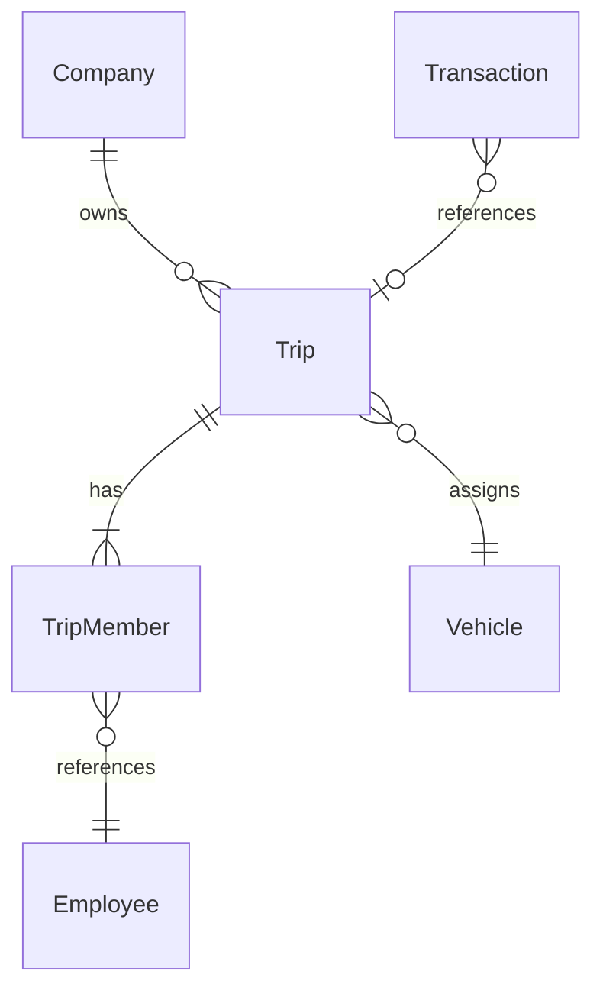

# Implementation Plan: P006 - Trip Management

**Branch**: `007-trip-management` | **Date**: 2026-07-08 | **Spec**: [spec.md](./spec.md)

**Input**: Feature specification from `/specs/007-trip-management/spec.md`

**Note**: This plan is the definitive technical design for Trip Management — not implementation code.
It follows architecture, conventions, and engineering decisions from P001–P005 without redefining them.

## Summary

Introduce a new `trip` module with `Trip` as aggregate root and `TripMember` as child entity. Trips
receive immutable `TRIP-YYYYMMDD-000001` numbers via `TripNumberSequence`. Lifecycle use cases
(create, update, start, complete, cancel, archive, member CRUD, list/search) coordinate Vehicle
status (`IN_USE` / `AVAILABLE`) and enforce one active Started trip per vehicle and per employee.
The `transaction` module gains Outside-only `tripId` enforcement (required, trip must be Started,
assignee must be member). Employee On Trip is derived from Started membership, not persisted.
Workforce dashboard `tripsSummary` populated for linked employees. All endpoints use established
P001 patterns: JWT auth, Zod, DTOs, standard envelope, OpenAPI, Vitest/Supertest.

## Technical Context

**Language/Version**: TypeScript (strict mode) on Node.js LTS

**Primary Dependencies**: Express.js, Prisma ORM, PostgreSQL, Zod, JWT (P001), Pino, Swagger/OpenAPI,
Vitest, Supertest (unchanged from P005)

**Storage**: PostgreSQL; new `Trip`, `TripMember`, `TripNumberSequence` tables; FK from
`Transaction.tripId` → `Trip.id`

**Testing**: Vitest (unit/integration), Supertest (API/workflow/authorization/concurrency)

**Target Platform**: Linux server (Docker); local dev via docker-compose

**Project Type**: modular REST API — new `trip` module + targeted `transaction` and
`workforce-dashboard` extensions

**Performance Goals**: Trip Number allocation without duplicates under concurrent create; start
transition atomic with vehicle status; trip list/search under 2s for typical company volumes;
member-filter queries use indexed `employeeId`

**Constraints**: Company tenant boundary; one Started trip per vehicle/employee; Outside
transactions require Started trip; Completed blocks new transactions; Cancelled immutable; archive
Completed/Cancelled only

**Scale/Scope**: 1 new module (~15 use cases), 12 HTTP routes, 3 member sub-routes, 4 status
actions; transaction module rule extension; dashboard summary update; ~3 Prisma models

## Constitution Check

_GATE: Must pass before Phase 0 research. Re-check after Phase 1 design._

| Gate                             | Pre-Design | Post-Design | Notes                                                   |
| -------------------------------- | ---------- | ----------- | ------------------------------------------------------- |
| Layer boundaries                 | ✅         | ✅          | New `trip` module; transaction reads Trip via repo      |
| No business logic in controllers | ✅         | ✅          | `trip.controller` delegates to use cases                |
| Repository pattern               | ✅         | ✅          | `TripRepository`, `TripNumberSequenceRepository`        |
| Dependency injection             | ✅         | ✅          | Wired in `src/config/container.ts`                      |
| Zod validation                   | ✅         | ✅          | `trip.schemas.ts` for all bodies/queries                |
| DTOs                             | ✅         | ✅          | Request/response DTOs; no entity leak                   |
| Standard response envelope       | ✅         | ✅          | Reuses P001 helpers                                     |
| Pagination conventions           | ✅         | ✅          | `page`, `limit`, `sortBy`, `sortOrder` on list          |
| Security                         | ✅         | ✅          | Role middleware + trip authorization policy             |
| No `any`                         | ✅         | ✅          | Strict TypeScript                                       |
| Error handling                   | ✅         | ✅          | Lifecycle/business rule errors for transitions          |
| Logging                          | ✅         | ✅          | `trip-audit.service` for lifecycle events               |
| Tests                            | ✅         | ✅          | Unit, integration, API, workflow, concurrency           |
| OpenAPI                          | ✅         | ✅          | `trip.openapi.ts` + `common-schemas.ts`                 |
| Simplicity                       | ✅         | ✅          | Sequence table justified (same as P005); no event store |

## Project Structure

### Documentation (this feature)

```text
specs/007-trip-management/
├── plan.md
├── research.md
├── data-model.md
├── quickstart.md
├── contracts/openapi.yaml
└── tasks.md              # Phase 2 — /speckit-tasks
```

### Source code (new + extensions)

```text
src/modules/trip/
├── domain/
│   ├── trip.entity.ts
│   ├── trip-member.entity.ts
│   ├── trip-status.ts
│   ├── trip-member-role.ts
│   ├── trip-rules.ts
│   ├── trip-lifecycle.ts
│   ├── trip-number.ts
│   ├── trip.repository.ts
│   └── trip-number-sequence.repository.ts
├── application/
│   ├── dto/
│   │   ├── create-trip.request.ts
│   │   ├── update-trip.request.ts
│   │   ├── trip.response.ts
│   │   └── trip-member.response.ts
│   ├── use-cases/
│   │   ├── create-trip.use-case.ts
│   │   ├── update-trip.use-case.ts
│   │   ├── get-trip.use-case.ts
│   │   ├── get-trip-by-number.use-case.ts
│   │   ├── list-trips.use-case.ts
│   │   ├── list-my-trips.use-case.ts
│   │   ├── archive-trip.use-case.ts
│   │   ├── start-trip.use-case.ts
│   │   ├── complete-trip.use-case.ts
│   │   ├── cancel-trip.use-case.ts
│   │   ├── add-trip-member.use-case.ts
│   │   ├── update-trip-member.use-case.ts
│   │   └── remove-trip-member.use-case.ts
│   ├── policies/
│   │   └── trip-authorization.policy.ts
│   └── services/
│       ├── trip-number.service.ts
│       ├── trip-audit.service.ts
│       └── trip-eligibility.service.ts
├── infrastructure/
│   ├── trip.prisma-repository.ts
│   ├── trip-number-sequence.prisma-repository.ts
│   └── mappers/
│       ├── trip.mapper.ts
│       └── trip-member.mapper.ts
├── presentation/
│   ├── trip.controller.ts
│   ├── trip.routes.ts
│   ├── trip.schemas.ts
│   └── trip.openapi.ts
└── index.ts

src/modules/transaction/                    # EXTENSIONS
├── domain/trip-rules.ts                    # NEW — Outside trip assertions
├── application/use-cases/
│   ├── create-transaction.use-case.ts      # MOD — trip validation
│   └── update-transaction.use-case.ts      # MOD — trip validation

src/modules/workforce-dashboard/
└── application/use-cases/
    └── get-workforce-dashboard.use-case.ts # MOD — tripsSummary

src/shared/trips/
└── trip-number-format.ts                   # NEW — formatter/parser

src/config/container.ts                     # MOD — wire trip module + deps

prisma/schema.prisma                        # MOD — Trip models + Transaction FK

tests/
├── unit/trip/
├── integration/trip/
└── api/trip/
```

**Structure Decision**: New bounded-context module per research; minimal cross-module writes
(vehicle status via repository); transaction module read-only trip validation.

## Complexity Tracking

No constitution violations requiring justification.

---

## 1. Module Architecture

### Responsibilities

| Component                        | Responsibility                                                            |
| -------------------------------- | ------------------------------------------------------------------------- |
| `trip` module                    | Trip aggregate lifecycle, numbering, members, discovery                   |
| `Trip` aggregate root            | Status transitions, header invariants, member collection authority        |
| `TripMember` child               | Employee participation with role; mutable only in Draft                   |
| `TripNumberService`              | Format and allocate numbers via sequence repository                       |
| `TripEligibilityService`         | `acceptsTransaction(trip)`, `acceptsExpense(trip)` for cross-module rules |
| `trip-authorization.policy`      | Role + membership matrix                                                  |
| `trip-rules` / `trip-lifecycle`  | Transition validation, concurrency assertions                             |
| `transaction` (extended)         | Enforce Outside → Started trip link                                       |
| `vehicle` (read/write via repo)  | Status `IN_USE` / `AVAILABLE` on start/complete                           |
| `workforce-dashboard` (extended) | Populate `tripsSummary`                                                   |

### Aggregate boundaries

```text
┌─────────────────────────────────────────────┐
│              Trip Aggregate                 │
│  ┌─────────┐      ┌──────────────────────┐  │
│  │  Trip   │ 1──* │     TripMember       │  │
│  │ (root)  │      │ (child, same boundary)│  │
│  └────┬────┘      └──────────────────────┘  │
└───────┼─────────────────────────────────────┘
        │ references (no ownership)
        ▼
   Vehicle, Employee, Transaction, Expense (future)
```

- **Inside aggregate**: Trip header, members, trip number, lifecycle timestamps, audit actor IDs.
- **Outside aggregate**: Vehicle entity (status updated via its repository), Employee (membership
  reference only), Transaction (`tripId` FK), Expense (future FK).

### Internal module organization

Standard Clean Architecture layers per P001:

```text
presentation → application (use cases) → domain ← infrastructure
```

Controllers parse/validate HTTP, call one use case, map DTO response. Use cases orchestrate
repositories and domain rules. Domain has zero framework imports.

### Dependencies

| Dependency    | Direction                                       | Usage                                      |
| ------------- | ----------------------------------------------- | ------------------------------------------ |
| `company`     | Read                                            | Tenant scope (implicit via auth)           |
| `vehicle`     | Read + status update                            | Assignment validation; IN_USE/AVAILABLE    |
| `employee`    | Read                                            | Member validation; enrichment on responses |
| `user`        | Read                                            | Audit actor resolution                     |
| `transaction` | Read (from trip) / Trip read (from transaction) | Count linked txs; Outside enforcement      |

Trip module MUST NOT import transaction use cases. Transaction module injects `TripRepository`
interface defined in trip domain (exported for cross-module DI).

### Shared services

| Service                       | Location            | Purpose                               |
| ----------------------------- | ------------------- | ------------------------------------- |
| `trip-number-format.ts`       | `src/shared/trips/` | Parse/validate `TRIP-YYYYMMDD-NNNNNN` |
| `trip-eligibility.service.ts` | trip application    | Cross-module eligibility checks       |
| `trip-audit.service.ts`       | trip application    | Structured Pino audit events          |

### Integration with Transactions

- P004 `Transaction.tripId` nullable column gains FK to `Trip.id`.
- `assertTripLinkForOutside` in transaction domain: OUTSIDE requires non-null `tripId`; other
  location types forbid `tripId`.
- `assertTripAcceptsTransaction(trip)`: status `STARTED`, same `companyId`.
- Optional: assigned Employee creating transaction must be trip member (product default: **yes**).
- Completed/Cancelled/Draft trips reject link on create/update.

### Integration with Workforce

- Employee On Trip: `TripRepository.findStartedTripIdsByEmployeeId(employeeId, companyId)`.
- No change to attendance module; operational readiness (timed in) remains P003 gate for
  transactions.
- Dashboard: load active Started trip for linked employee into `tripsSummary`.

### Integration with Organization

- Vehicle from P002: validate `AVAILABLE` at Draft assignment; `IN_USE` on start; restore
  `AVAILABLE` on complete if trip caused `IN_USE`.
- Reject `MAINTENANCE`, `INACTIVE`, archived vehicles for assignment/start.

### Why Trip is an Aggregate Root

1. **Lifecycle authority** — `status` drives all editability and operational gates.
2. **Invariant locality** — one active trip per vehicle/employee, member uniqueness, start
   completeness are trip-level rules.
3. **Transactional consistency** — start must atomically update trip, vehicle, and validate
   members.
4. **Independent existence** — trips are planned before any transaction exists.
5. **Reference, not ownership** — transactions reference trips; deleting/archiving trips does not
   cascade-delete transactions (`tripId` remains historical).

---

## 2. Entity Design

See [data-model.md](./data-model.md) for full field tables and Prisma sketch.

### Trip

| Concern     | Design                                                                                                                  |
| ----------- | ----------------------------------------------------------------------------------------------------------------------- |
| Purpose     | Coordinate field operations outside company premises                                                                    |
| PK          | `id` UUID                                                                                                               |
| Tenant      | `companyId`                                                                                                             |
| Business ID | `tripNumber` immutable                                                                                                  |
| Vehicle     | `vehicleId` FK                                                                                                          |
| Schedule    | `scheduledStart`, `actualStart`, `actualEnd`                                                                            |
| Route       | `origin`, `destination` text                                                                                            |
| Status      | `DRAFT \| STARTED \| COMPLETED \| CANCELLED`                                                                            |
| Audit       | `createdByUserId`, `updatedByUserId`, `startedByUserId`, `completedByUserId`, `cancelledByUserId`, `cancellationReason` |
| Soft delete | `deletedAt` on archive                                                                                                  |

**Domain methods**: `isDraft()`, `isStarted()`, `isCompleted()`, `isCancelled()`, `isArchived()`,
`assertEditable()`, `assertStartable()`, `assertCompletable()`, `assertCancellable()`,
`assertArchivable()`.

### TripMember

| Concern  | Design                                    |
| -------- | ----------------------------------------- |
| Purpose  | Employee participation with role          |
| PK       | `id` UUID                                 |
| Parent   | `tripId` FK                               |
| Employee | `employeeId` FK                           |
| Role     | `DRIVER \| HELPER \| BUYER \| SUPERVISOR` |

**Domain methods**: none beyond identity; parent trip governs mutability.

### TripStatus enum

```typescript
// domain/trip-status.ts
['DRAFT', 'STARTED', 'COMPLETED', 'CANCELLED'];
```

### TripMemberRole enum

```typescript
// domain/trip-member-role.ts
['DRIVER', 'HELPER', 'BUYER', 'SUPERVISOR'];
```

---

## 3. Relationship Design



**Ownership summary**:

| From        | To         | Cardinality | Ownership                              |
| ----------- | ---------- | ----------- | -------------------------------------- |
| Company     | Trip       | 1:N         | Company owns trips                     |
| Trip        | TripMember | 1:N         | Trip owns members                      |
| Trip        | Vehicle    | N:1         | Reference; vehicle owned by org module |
| TripMember  | Employee   | N:1         | Reference                              |
| Transaction | Trip       | N:0..1      | Reference only                         |

---

## 4. State Machine Design

### Allowed transitions

| From    | To        | Action   | Actor          |
| ------- | --------- | -------- | -------------- |
| DRAFT   | STARTED   | start    | Manager, Owner |
| DRAFT   | CANCELLED | cancel   | Manager, Owner |
| STARTED | COMPLETED | complete | Manager, Owner |

### Invalid transitions (reject with `LifecycleConflictError`)

- STARTED → DRAFT, STARTED → CANCELLED
- COMPLETED → any, CANCELLED → any (except archive metadata)
- DRAFT → COMPLETED (must start first)
- Any transition on archived trip

### Vehicle state changes

| Trip event | Vehicle transition     | Guard                                      |
| ---------- | ---------------------- | ------------------------------------------ |
| start      | → `IN_USE`             | Was `AVAILABLE`, not on other Started trip |
| complete   | `IN_USE` → `AVAILABLE` | Only if trip set In Use                    |

### Employee availability

| Trip event | Employee logical state                 |
| ---------- | -------------------------------------- |
| start      | On Trip (derived)                      |
| complete   | Available (if still timed in per P003) |

### Locking behavior

- **DRAFT**: header and members editable.
- **STARTED**: read-only header/members; transactions allowed.
- **COMPLETED**: read-only; no new transactions; expenses allowed (future).
- **CANCELLED**: fully immutable except archive.

### Reopen behavior

**None in P006.**

---

## 5. Business Workflow

### Manager / Owner

```text
1. Create Trip (DRAFT) → Trip Number assigned
2. Assign / change Vehicle (AVAILABLE)
3. Add / update / remove Members (roles)
4. Set scheduledStart, origin, destination, notes
5. Start Trip → vehicle IN_USE, members On Trip
6. [Employees create Outside transactions linked to trip]
7. Complete Trip → vehicle AVAILABLE, block new transactions
8. [Optional: post-trip expenses — future module]
9. Archive Completed or Cancelled trip

Alternate: Cancel Draft trip → immutable, no operations
```

### Employee

```text
1. View assigned Draft trips (upcoming) via GET /trips/mine
2. View Started trip (active) — participate in field work
3. Create Outside transactions when timed in + trip Started + is member
4. View Completed history via GET /trips/mine?status=COMPLETED
```

Employees never create, edit, start, complete, cancel, or archive trips.

---

## 6. Trip Number Strategy

| Aspect            | Design                                                        |
| ----------------- | ------------------------------------------------------------- |
| Generation timing | Synchronous in `CreateTripUseCase` before first commit        |
| Format            | `TRIP-{YYYYMMDD}-{000001}`                                    |
| Date component    | UTC calendar date from `createdAt`                            |
| Sequence scope    | Per `(companyId, sequenceDate)`                               |
| Uniqueness        | DB unique `(companyId, tripNumber)`                           |
| Searching         | Exact on `by-number` route; prefix on list `tripNumber` query |
| After cancel      | Number retained                                               |
| After archive     | Number retained                                               |
| Immutability      | Excluded from PATCH; no admin override                        |

**Example**: First trip created 2026-07-08 UTC → `TRIP-20260708-000001`.

Implementation mirrors `TransactionNumberService` / `TripNumberSequence` per [research.md](./research.md).

---

## 7. API Design

Base path: `/api/v1/trips`. Standard envelope on all responses. See
[contracts/openapi.yaml](./contracts/openapi.yaml).

### Trips

| Purpose             | Method | URI                             | Auth             | Request             | Response                | Errors             |
| ------------------- | ------ | ------------------------------- | ---------------- | ------------------- | ----------------------- | ------------------ |
| Create Draft trip   | POST   | `/trips`                        | Mgr, Owner       | `CreateTripRequest` | `TripDetail` 201        | 400, 403, 404, 409 |
| Update Draft header | PATCH  | `/trips/{tripId}`               | Mgr, Owner       | `UpdateTripRequest` | `TripDetail`            | 400, 403, 404, 409 |
| Get trip            | GET    | `/trips/{tripId}`               | All*             | —                   | `TripDetail`            | 403, 404           |
| List company trips  | GET    | `/trips`                        | Mgr, Owner       | query filters       | paginated `TripSummary` | 400, 403           |
| List my trips       | GET    | `/trips/mine`                   | Emp+             | status filter       | paginated `TripSummary` | 403                |
| Get by Trip Number  | GET    | `/trips/by-number/{tripNumber}` | Mgr, Owner, Emp* | —                   | `TripDetail`            | 403, 404           |
| Archive trip        | POST   | `/trips/{tripId}/archive`       | Mgr, Owner       | optional reason     | `TripDetail`            | 403, 404, 409      |

\*Employee: member scope enforced in use case.

**List query params**: `page`, `limit`, `sortBy` (`scheduledStart`, `createdAt`, `tripNumber`),
`sortOrder`, `status`, `vehicleId`, `employeeId`, `fromDate`, `toDate`, `tripNumber` (prefix),
`includeArchived`.

### Trip Members

| Purpose       | Method | URI                                  | Request              | Errors                                       |
| ------------- | ------ | ------------------------------------ | -------------------- | -------------------------------------------- |
| Add member    | POST   | `/trips/{tripId}/members`            | `employeeId`, `role` | 404, 409 duplicate, 409 not Draft            |
| Update role   | PATCH  | `/trips/{tripId}/members/{memberId}` | `role`               | 404, 409 not Draft                           |
| Remove member | DELETE | `/trips/{tripId}/members/{memberId}` | —                    | 404, 409 not Draft, 409 last member at start |

### Trip Status

| Purpose  | Method | URI                        | Request           | Errors                                                             |
| -------- | ------ | -------------------------- | ----------------- | ------------------------------------------------------------------ |
| Start    | POST   | `/trips/{tripId}/start`    | optional note     | 409 not Draft, 409 vehicle busy, 409 employee busy, 409 incomplete |
| Complete | POST   | `/trips/{tripId}/complete` | optional note     | 409 not Started                                                    |
| Cancel   | POST   | `/trips/{tripId}/cancel`   | required `reason` | 409 not Draft                                                      |

### Route registration order

Register `/trips/mine` and `/trips/by-number/:tripNumber` **before** `/trips/:tripId`.

---

## 8. Validation Design

### Zod schemas (`trip.schemas.ts`)

| Schema                                   | Rules                                                                                  |
| ---------------------------------------- | -------------------------------------------------------------------------------------- |
| `createTripSchema`                       | required vehicleId, scheduledStart, origin, destination; optional notes, members array |
| `updateTripSchema`                       | min 1 field; Draft only (use case)                                                     |
| `addTripMemberSchema`                    | employeeId uuid, role enum                                                             |
| `updateTripMemberSchema`                 | role enum                                                                              |
| `startTripSchema` / `completeTripSchema` | optional note max 500                                                                  |
| `cancelTripSchema`                       | reason min 1 max 1000                                                                  |
| `listTripsQuerySchema`                   | pagination + filters per constitution                                                  |
| `tripIdParamsSchema`                     | uuid                                                                                   |

### Trip validation (domain + Zod)

- `origin`, `destination`: non-empty, max 500
- `scheduledStart`: valid datetime
- `notes`: max 2000
- `tripNumber`: not accepted from client

### Member validation

- Role in `TripMemberRole` enum
- No duplicate `employeeId` per trip
- Employee active in company

### Vehicle validation

- Exists in company, not archived
- Not `MAINTENANCE` or `INACTIVE` for assign/start
- No other `STARTED` trip on same vehicle at start

### Status transition validation

Delegated to `trip-lifecycle.ts` + use case guards.

### Business validation (shared)

`src/validations/trip.schemas.ts` or extend `workforce.schemas.ts` with `tripMemberRoleSchema` for
reuse.

### Transaction extension (`transaction.schemas.ts`)

- When `locationType === 'OUTSIDE'`: `tripId` required uuid
- Otherwise: `tripId` must be absent or null

---

## 9. Authorization Matrix

| Action             | Owner | Manager | Employee       |
| ------------------ | ----- | ------- | -------------- |
| Create trip        | ✅    | ✅      | ❌             |
| Edit trip (Draft)  | ✅    | ✅      | ❌             |
| Assign members     | ✅    | ✅      | ❌             |
| Assign vehicle     | ✅    | ✅      | ❌             |
| Start trip         | ✅    | ✅      | ❌             |
| Complete trip      | ✅    | ✅      | ❌             |
| Cancel trip        | ✅    | ✅      | ❌             |
| Archive trip       | ✅    | ✅      | ❌             |
| List company trips | ✅    | ✅      | ❌             |
| View trip detail   | ✅    | ✅      | ✅ member only |
| List my trips      | ✅*   | ✅*     | ✅             |

\*Owner/Manager with linked employee profile may use `/trips/mine`; company list uses `/trips`.

Implementation: `authorize(['OWNER', 'MANAGER'])` on mutating routes;
`authorize(['OWNER', 'MANAGER', 'EMPLOYEE'])` on reads with `trip-authorization.policy.ts`
assertions in use cases.

---

## 10. Business Rules

Encoded in `trip-rules.ts` and enforced in use cases:

1. Only Managers and Owners create/manage trips.
2. Employees view assigned trips only.
3. One Started trip per vehicle (company scope).
4. One Started trip per employee (company scope).
5. Outside transactions require Started trip (transaction module).
6. Completed trips reject new transactions.
7. Completed trips allow expenses (future — `TripEligibilityService`).
8. Cancelled trips immutable.
9. Trip Numbers immutable.
10. Vehicle on active trip cannot start another.
11. Employee on active trip cannot join another Started trip.
12. Start requires ≥1 member, vehicle, origin, destination, scheduledStart.
13. Archive only Completed or Cancelled.

---

## 11. Error Scenarios

| Scenario                         | HTTP    | Code                                             |
| -------------------------------- | ------- | ------------------------------------------------ |
| Vehicle on another Started trip  | 409     | `LIFECYCLE_CONFLICT`                             |
| Employee on another Started trip | 409     | `LIFECYCLE_CONFLICT`                             |
| Trip already started             | 409     | `LIFECYCLE_CONFLICT`                             |
| Trip already completed           | 409     | `LIFECYCLE_CONFLICT`                             |
| Trip already cancelled           | 409     | `LIFECYCLE_CONFLICT`                             |
| Invalid state transition         | 409     | `LIFECYCLE_CONFLICT`                             |
| Edit non-Draft trip              | 409     | `LIFECYCLE_CONFLICT`                             |
| Cross-company access             | 403/404 | `COMPANY_SCOPE_VIOLATION` / `RESOURCE_NOT_FOUND` |
| Employee view unassigned         | 403     | `FORBIDDEN`                                      |
| Employee mutate                  | 403     | `FORBIDDEN`                                      |
| Validation failure               | 400     | `VALIDATION_ERROR`                               |
| Vehicle/employee not found       | 404     | `RESOURCE_NOT_FOUND`                             |
| Duplicate member                 | 409     | `DUPLICATE_RESOURCE`                             |
| Trip not accepting transaction   | 409     | `BUSINESS_RULE_VIOLATION`                        |

---

## 12. Swagger Design

### Tags

- `Trips` — CRUD, list, archive, lookup
- `Trip Members` — member CRUD
- `Trip Status` — start, complete, cancel

### Schemas (`common-schemas.ts`)

- `TripStatus`, `TripMemberRole`, `TripNumber`
- `TripSummary`, `TripDetail`, `TripMember`
- `VehicleSummary` (embedded)
- `CreateTripRequest`, `UpdateTripRequest`, `AddTripMemberRequest`, etc.

### Reusable bodies

Mirror Zod schemas in OpenAPI components (same pattern as P005 settlement requests).

### Responses

- Success: standard envelope + `data: TripDetail | TripSummary[]`
- List: `meta: { page, limit, total, totalPages }`
- Errors: existing `ApiErrorEnvelope`

### Examples

```json
{
  "tripNumber": "TRIP-20260708-000001",
  "status": "STARTED",
  "origin": "Main Warehouse",
  "destination": "Supplier Yard, Quezon City"
}
```

Register paths in `trip.openapi.ts`; aggregate into main Swagger config like other modules.

---

## 13. Testing Strategy

### Unit tests (`tests/unit/trip/`)

- `trip.entity.test.ts` — status helpers
- `trip-lifecycle.test.ts` — transition matrix
- `trip-rules.test.ts` — start completeness, concurrency assertions
- `trip-number.service.test.ts` — format, padding
- `trip-eligibility.service.test.ts` — acceptsTransaction/Expense
- `trip-authorization.policy.test.ts`

### Integration tests (`tests/integration/trip/`)

- `trip.persistence.test.ts` — CRUD, soft delete
- `trip-number-sequence.persistence.test.ts` — concurrent allocation
- `trip-start.persistence.test.ts` — vehicle status + partial unique constraint
- `trip-transaction-link.persistence.test.ts` — FK integrity

### API tests (`tests/api/trip/`)

- `trip-create.api.test.ts`
- `trip-lifecycle.api.test.ts` — start/complete/cancel workflow
- `trip-members.api.test.ts`
- `trip-list-search.api.test.ts`
- `trip-authorization.api.test.ts`
- `trip-concurrency.api.test.ts` — parallel start same vehicle
- `trip-transaction-outside.api.test.ts` — Outside enforcement

### Workflow tests

End-to-end: plan → start → create Outside transaction → complete → reject second transaction.

### Factories

`tests/factories/trip.factory.ts` — payload builders for create/start/members.

---

## 14. Acceptance Criteria (Engineering)

- [ ] All plan endpoints implemented and documented in OpenAPI
- [ ] Trip Number assigned at create; unique under concurrent POST
- [ ] Partial unique index prevents two Started trips per vehicle
- [ ] Application checks prevent two Started trips sharing an employee
- [ ] Vehicle `IN_USE` on start, `AVAILABLE` on complete (integration test)
- [ ] Outside transaction without `tripId` returns 400
- [ ] Outside transaction with Draft/Completed/Cancelled `tripId` returns 409
- [ ] Employee cannot access unassigned trip (403)
- [ ] Employee cannot POST/PATCH trip routes (403)
- [ ] Cancelled trip PATCH returns 409
- [ ] Archive Draft returns 409; Archive Completed succeeds
- [ ] `GET /trips/by-number/{tripNumber}` works within tenant
- [ ] Workforce dashboard `tripsSummary` non-empty for employee on Started trip
- [ ] All unit + integration + API tests pass in CI
- [ ] Constitution Check gates remain satisfied

---

## 15. Future Extensibility

The Trip aggregate supports future modules **without redesign**:

| Future module      | Integration                                                       |
| ------------------ | ----------------------------------------------------------------- |
| Expenses           | `expense.tripId` FK; call `TripEligibilityService.acceptsExpense` |
| Analytics          | Aggregate on `status`, `actualStart`, `actualEnd`, `tripNumber`   |
| Reports            | Join Trip → Transaction totals by `tripId`                        |
| GPS Tracking       | Add nullable lat/lng columns to Trip header                       |
| Route Optimization | Add `routePolyline` or related table child of Trip                |
| Geofencing         | Add `geofenceId` or boundary table                                |
| Mileage Tracking   | Add `estimatedDistanceKm`, `actualDistanceKm`                     |

Stable contracts for downstream specs:

- `trip.id`, `trip.tripNumber`, `trip.status`
- Lifecycle terminal semantics (Completed vs Cancelled)
- Member roster snapshot at start (immutable after Started)

---

## Phase Artifacts

| Artifact      | Path                                               | Status                   |
| ------------- | -------------------------------------------------- | ------------------------ |
| Research      | [research.md](./research.md)                       | ✅ Complete              |
| Data model    | [data-model.md](./data-model.md)                   | ✅ Complete              |
| API contracts | [contracts/openapi.yaml](./contracts/openapi.yaml) | ✅ Complete              |
| Quickstart    | [quickstart.md](./quickstart.md)                   | ✅ Complete              |
| Tasks         | tasks.md                                           | Pending `/speckit-tasks` |
