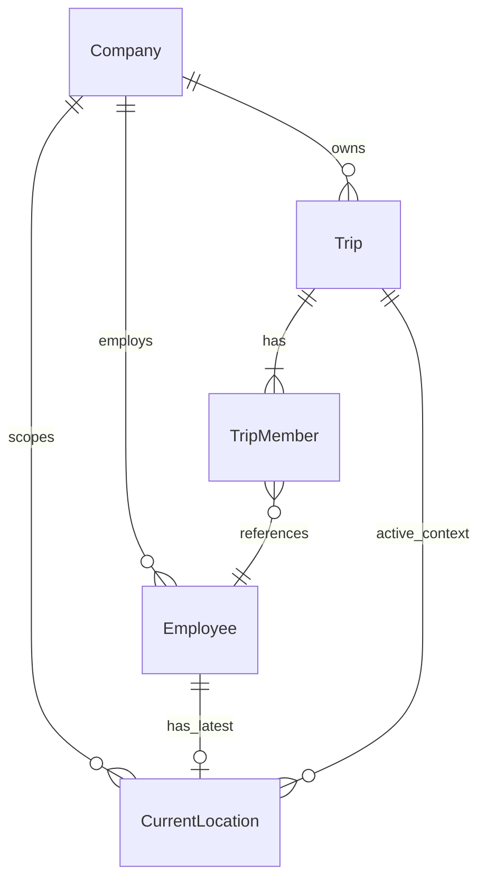

# Data Model: Live GPS Tracking (P012)

**Feature**: `016-live-gps-tracking`  
**Depends on**: P001 Company/User, P003 Employee, P006 Trip (Started status, TripMember)

## Overview

P012 introduces **`CurrentLocation`** as a standalone aggregate (not owned by Trip). One row per
Employee stores the latest GPS point and associations to Company and active Started Trip. Tracking
status (Online/Offline) is **derived** from `lastSeenAt` — not persisted. Historical location
streams are intentionally absent.

## CurrentLocation

**Purpose**: Stores the single latest known geographic position for an Employee during field
operations. Updated in place on each accepted location transmission; never historized.

### Fields

| Field          | Type     | Nullable | Notes                                                                                  |
| -------------- | -------- | -------- | -------------------------------------------------------------------------------------- |
| id             | UUID     | No       | PK                                                                                     |
| companyId      | UUID     | No       | FK → Company; tenant scope; denormalized for query/filter efficiency                   |
| employeeId     | UUID     | No       | FK → Employee; **unique** — one row per employee                                       |
| tripId         | UUID     | Yes      | FK → Trip; MUST reference Started trip while tracking active; cleared on trip complete |
| latitude       | decimal  | No       | −90..+90; precision suitable for GPS (e.g., decimal 8)                                 |
| longitude      | decimal  | No       | −180..+180                                                                             |
| speed          | decimal  | Yes      | m/s or km/h per API contract (document unit in OpenAPI); ≥ 0                           |
| heading        | decimal  | Yes      | 0..360 degrees                                                                         |
| accuracy       | decimal  | Yes      | Meters; ≥ 0; null when device unavailable                                              |
| batteryLevel   | integer  | Yes      | 0..100 percent                                                                         |
| isMockLocation | boolean  | No       | Default false; updates with `true` rejected                                            |
| lastSeenAt     | datetime | No       | Device capture timestamp of accepted location (not only server receive)                |
| createdAt      | datetime | No       | First location recorded for this employee row                                          |
| updatedAt      | datetime | No       | Last successful upsert                                                                 |

### Relationships

```text
Company 1──* CurrentLocation
Employee 1──0..1 CurrentLocation   (unique employeeId enforces 0..1)
Trip 1──* CurrentLocation          (reference; trip does not own row)
```



### Indexes

| Index / constraint                    | Purpose                                                |
| ------------------------------------- | ------------------------------------------------------ |
| `employeeId` UNIQUE                   | Enforce one current location per Employee              |
| `(companyId, employeeId)`             | Tenant-scoped employee lookup                          |
| `(companyId, tripId)`                 | List locations for active trip monitoring              |
| `(companyId, lastSeenAt)`             | Company-wide active tracking queries / staleness sweep |
| `(tripId)` WHERE `tripId IS NOT NULL` | Trip detail map load                                   |

### Composite indexes

| Composite                         | Usage                                              |
| --------------------------------- | -------------------------------------------------- |
| `(companyId, tripId, employeeId)` | Trip locations panel — members joined to locations |
| `(companyId, updatedAt DESC)`     | Optional admin diagnostics (support tooling)       |

### Constraints

- `employeeId` UNIQUE NOT NULL — at most one row per Employee globally (Employee already belongs to one Company)
- `companyId` MUST match Employee.companyId and Trip.companyId on write
- `tripId` MUST reference Trip with `status = STARTED` on upsert; NULL allowed after trip complete
- `latitude`/`longitude` within valid Earth bounds
- `lastSeenAt` MUST NOT decrease on successful upsert (monotonic per employee)
- `isMockLocation = true` → reject upsert (application rule; column still stored false on success)
- No CASCADE delete of historical trips required — `tripId` SET NULL on trip complete via application logic

### Unique rules

| Rule                      | Enforcement                        |
| ------------------------- | ---------------------------------- |
| One row per Employee      | UNIQUE(`employeeId`)               |
| One logical current point | Upsert replaces row; no second row |

### Audit strategy

| Event                          | Mechanism                                                                                          |
| ------------------------------ | -------------------------------------------------------------------------------------------------- |
| First location on Started Trip | Activity Log `tracking.started` (Employee, Trip, Company)                                          |
| Trip complete stops tracking   | Activity Log `tracking.stopped` per affected employee + trip audit linkage                         |
| Accepted/rejected GPS update   | Pino structured log: outcome, employeeId, tripId, userId — **no** coordinate logging at info level |
| WebSocket connect/disconnect   | Pino debug: userId, role, companyId, rooms joined                                                  |

Coordinates MUST NOT appear in Activity Log descriptions or metadata (privacy + no history policy).

### Soft delete strategy

**None.** Row persists as latest known state. When Employee never tracked, no row exists. When trip
completes, `tripId` cleared; coordinates may remain until overwritten by next Started Trip or left
stale (monitoring queries filter by Started trips and active `tripId`).

### Future extensibility

| Future capability        | Extension approach                                               |
| ------------------------ | ---------------------------------------------------------------- |
| Route history            | New `LocationHistory` table + optional async copy from upsert    |
| Geofencing               | New `Geofence` entity; subscribe to `UpsertCurrentLocation` port |
| Vehicle tracking         | Optional `vehicleId` on CurrentLocation or parallel entity       |
| Company staleness config | `Company.trackingStalenessSeconds` column                        |
| Redis broadcast          | `TrackingBroadcastPort` adapter swap                             |

Core `CurrentLocation` shape remains stable; historized tables are additive.

## Derived: TrackingStatus (not persisted)

| Value   | Condition                                                                |
| ------- | ------------------------------------------------------------------------ |
| ONLINE  | Row exists, `tripId` not null, Trip Started, `now - lastSeenAt ≤ window` |
| OFFLINE | No row, null tripId, trip not Started, or `now - lastSeenAt > window`    |

Default staleness window: **5 minutes** (`TRACKING_STALENESS_MS=300000`).

## Configuration (environment)

| Variable                | Default           | Purpose                             |
| ----------------------- | ----------------- | ----------------------------------- |
| `TRACKING_STALENESS_MS` | 300000            | Offline threshold                   |
| `TRACKING_SWEEP_MS`     | 60000             | Interval for offline event emission |
| `WS_PATH`               | `/ws/v1/tracking` | WebSocket mount path                |

## Prisma sketch (reference for implementers — not generated here)

Implementers will add model `CurrentLocation` with relations to `Company`, `Employee`, `Trip` and
`@@unique([employeeId])`. Exact Prisma syntax belongs in implementation phase migrations.

## Cross-module read dependencies

| Module    | Reads from tracking                      |
| --------- | ---------------------------------------- |
| Trip      | None (trip complete calls tracking port) |
| Employee  | None                                     |
| Dashboard | Optional future: active field map widget |

Tracking module reads: `TripRepository.findStartedTripForEmployee`, `TripRepository.findById`,
`EmployeeRepository.findById`, `UserRepository` (employee link).
