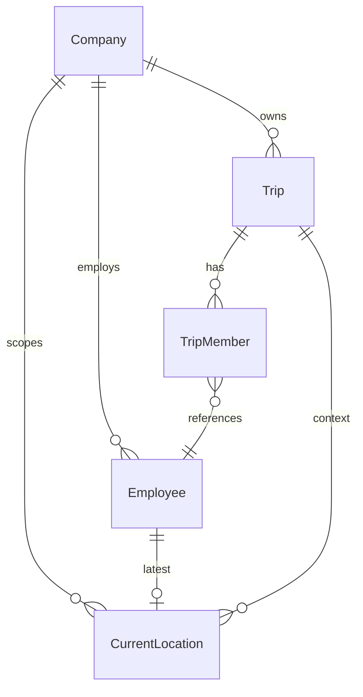

# Implementation Plan: P012 — Live GPS Tracking

**Branch**: `016-live-gps-tracking` | **Date**: 2026-07-20 | **Spec**: [spec.md](./spec.md)

**Input**: Feature specification from `/specs/016-live-gps-tracking/spec.md`

**Note**: Software architecture and technical design only — not implementation code. Follows
architecture and conventions from P001–P011 without redefining them.

## Summary

Introduce a new **`tracking`** module with **`CurrentLocation`** as its aggregate (one upserted row
per Employee). The Tracking Application authenticates via existing JWT, transmits GPS over **REST
PUT** and/or **WebSocket uplink**, and the system validates Started Trip membership before upsert.
**Owners/Managers** load initial state via REST, then subscribe to **WebSocket rooms** for live
updates. **`TrackingBroadcastPort`** fans out business events (`location:updated`,
`tracking:stopped`, etc.). **`CompleteTripUseCase`** invokes **`TrackingLifecyclePort`** to halt
tracking when trips end. Online/Offline is derived from `lastSeenAt` with a configurable staleness
window (default 5 minutes). New dependency: **`ws`** for WebSocket upgrade on the existing HTTP server.

## Technical Context

**Language/Version**: TypeScript (strict mode) on Node.js LTS (≥22)

**Primary Dependencies**: Express.js, Prisma ORM, PostgreSQL, Zod, JWT (P001), Pino,
Swagger/OpenAPI, Vitest, Supertest — **new**: `ws` (WebSocket)

**Storage**: PostgreSQL; new `CurrentLocation` table with UNIQUE(`employeeId`); UPSERT-only writes

**Testing**: Vitest (unit/integration), Supertest (REST/API/authz), WebSocket integration tests via
`ws` client

**Target Platform**: Linux server (Docker/Railway); local dev via docker-compose

**Project Type**: modular REST + WebSocket API — new `tracking` module + thin hook in `trip`
(`CompleteTripUseCase`)

**Performance Goals**: Location upsert p95 < 100ms; WebSocket fan-out to authorized subscribers
within 5s under normal load (SC-001); staleness sweep O(n) on active rows only (`tripId IS NOT NULL`)

**Constraints**: Company tenant boundary; one current location per Employee; no GPS history; Started
Trip only; mock locations rejected; Employee transmit / Owner-Manager read matrix

**Scale/Scope**: 1 new module (~8 use cases), 6 REST routes, 1 WebSocket mount, 1 Prisma model,
trip complete port, activity log actions (started/stopped only), ~2 new shared geo validators

## Constitution Check

_GATE: Must pass before Phase 0 research. Re-check after Phase 1 design._

| Gate                             | Pre-Design | Post-Design | Notes                                                      |
| -------------------------------- | ---------- | ----------- | ---------------------------------------------------------- |
| Layer boundaries                 | ✅         | ✅          | Domain free of `ws`/Prisma; WS gateway in presentation     |
| No business logic in controllers | ✅         | ✅          | Controllers/gateway delegate to use cases                  |
| Repository pattern               | ✅         | ✅          | `CurrentLocationRepository`                                |
| Dependency injection             | ✅         | ✅          | Wired in `src/config/container.ts`                         |
| Zod validation                   | ✅         | ✅          | `tracking.schemas.ts` + WS message schemas                 |
| DTOs                             | ✅         | ✅          | Request/response DTOs; no entity leak                      |
| Standard response envelope       | ✅         | ✅          | Reuses P001 `success()` / error helpers                    |
| Pagination conventions           | ✅         | ✅          | Active trips list uses `page`, `limit`                     |
| Security                         | ✅         | ✅          | JWT on REST + WS; mock GPS rejected; tenant isolation      |
| No `any`                         | ✅         | ✅          | Strict TypeScript                                          |
| Error handling                   | ✅         | ✅          | Normalized codes: `NO_ACTIVE_TRIP`, `STALE_LOCATION`, etc. |
| Logging                          | ✅         | ✅          | Pino structured; no coordinates at info level              |
| Tests                            | ✅         | ✅          | Unit, integration, API, WS authz                           |
| OpenAPI                          | ✅         | ✅          | `tracking.openapi.ts` + contracts/openapi.yaml             |
| Simplicity                       | ✅         | ✅          | `ws` justified in Complexity Tracking; no Redis in MVP     |

## Project Structure

### Documentation (this feature)

```text
specs/016-live-gps-tracking/
├── plan.md
├── research.md
├── data-model.md
├── quickstart.md
├── contracts/
│   ├── openapi.yaml
│   └── websocket-events.md
└── tasks.md              # Phase 2 — /speckit-tasks
```

### Source code (new + extensions)

```text
src/modules/tracking/
├── domain/
│   ├── current-location.entity.ts
│   ├── tracking-status.ts
│   ├── coordinates.vo.ts
│   ├── tracking-rules.ts
│   ├── current-location.repository.ts
│   └── ports/
│       ├── tracking-broadcast.port.ts
│       └── tracking-lifecycle.port.ts
├── application/
│   ├── dto/
│   │   ├── upsert-location.request.ts
│   │   ├── current-location.response.ts
│   │   ├── trip-tracking.response.ts
│   │   └── tracking-status.response.ts
│   ├── use-cases/
│   │   ├── upsert-current-location.use-case.ts
│   │   ├── get-employee-location.use-case.ts
│   │   ├── get-employee-tracking-status.use-case.ts
│   │   ├── get-trip-tracking-locations.use-case.ts
│   │   ├── list-active-trip-locations.use-case.ts
│   │   ├── admin-list-company-trip-locations.use-case.ts
│   │   └── stop-tracking-for-trip.use-case.ts
│   ├── policies/
│   │   └── tracking-authorization.policy.ts
│   └── services/
│       ├── tracking-context.service.ts
│       ├── tracking-status.service.ts
│       ├── tracking-broadcast.service.ts
│       ├── tracking-staleness-sweep.service.ts
│       └── tracking-audit.service.ts
├── infrastructure/
│   ├── current-location.prisma-repository.ts
│   ├── tracking-broadcast.ws-adapter.ts
│   ├── tracking-lifecycle.adapter.ts
│   └── mappers/
│       └── current-location.mapper.ts
├── presentation/
│   ├── tracking.controller.ts
│   ├── tracking.routes.ts
│   ├── tracking.schemas.ts
│   ├── tracking.openapi.ts
│   └── tracking-websocket.gateway.ts
└── index.ts

src/modules/trip/
└── application/use-cases/
    └── complete-trip.use-case.ts          # MOD — inject TrackingLifecyclePort

src/shared/geo/
├── latitude-longitude.schema.ts           # NEW — shared Zod geo validators
└── tracking-staleness.ts                  # NEW — env-backed defaults

src/config/
├── container.ts                           # MOD — wire tracking module + WS gateway
└── env.ts                                 # MOD — TRACKING_* vars

src/server.ts                              # MOD — attach WebSocketServer upgrade
src/app.ts                                 # MOD — register tracking routes

prisma/schema.prisma                       # MOD — CurrentLocation model

tests/
├── unit/tracking/
├── integration/tracking/
└── api/tracking/
```

**Structure Decision**: Independent `tracking` bounded context. Trip module calls tracking lifecycle
port on complete only; tracking reads trip/employee via repository interfaces (no trip use-case
imports from tracking).

## Complexity Tracking

| Violation / addition | Why Needed                                         | Simpler Alternative Rejected Because                   |
| -------------------- | -------------------------------------------------- | ------------------------------------------------------ |
| New `ws` dependency  | Real-time bidirectional GPS uplink + fan-out       | REST-only polling fails latency spec and battery goals |
| WebSocket gateway    | Spec requires live updates without page refresh    | SSE cannot receive Employee GPS uplink on same channel |
| Broadcast port       | Future Redis multi-instance without use-case churn | Direct WS calls from use cases block scaling path      |

---

## 1. Module Architecture

### Responsibilities

| Component                       | Responsibility                                                                      |
| ------------------------------- | ----------------------------------------------------------------------------------- |
| `tracking` module               | Current location upsert, read APIs, WS gateway, broadcast, staleness sweep          |
| `CurrentLocation` entity        | Invariants: coordinates, monotonic `lastSeenAt`, trip association                   |
| `UpsertCurrentLocationUseCase`  | Validate auth context → resolve Employee → assert Started Trip → upsert → broadcast |
| `TrackingContextService`        | Resolve `employeeId` from JWT; resolve Started Trip for Employee (P006 rules)       |
| `TrackingStatusService`         | Derive ONLINE/OFFLINE from `lastSeenAt` + staleness config                          |
| `TrackingBroadcastService`      | Implements `TrackingBroadcastPort`; room fan-out                                    |
| `TrackingStalenessSweepService` | Periodic offline detection + `employee:offline` events                              |
| `TrackingAuthorizationPolicy`   | Role matrix for read/transmit/subscribe                                             |
| `tracking-websocket.gateway`    | Connection auth, subscribe handling, uplink `location:update` routing               |
| `trip` (extension)              | On complete → `stopTrackingForTrip`                                                 |
| `activity-log` (extension)      | `tracking.started`, `tracking.stopped` via recorder                                 |

### Separation from Trip Management

| Concern           | Trip module (P006)          | Tracking module (P012)                |
| ----------------- | --------------------------- | ------------------------------------- |
| Trip lifecycle    | Draft/Start/Complete/Cancel | Read Started status; stop on complete |
| Member assignment | CRUD on TripMember          | Read membership for transmit gate     |
| Route text        | origin/destination          | Not duplicated                        |
| GPS coordinates   | Out of scope in P006        | Owned by tracking                     |
| Real-time events  | Trip audit logs             | Location broadcast events             |

Tracking **references** Trip by `tripId`; it does **not** embed trip lifecycle logic beyond
eligibility checks delegated to `TripRepository` / shared trip rules.

### Why Live Tracking is an independent module

1. **Different aggregate** — `CurrentLocation` lifecycle (upsert/replace) differs from Trip lifecycle.
2. **Different clients** — dedicated Tracking Application + dashboard WebSocket subscribers.
3. **Different non-functional profile** — high-frequency writes, real-time fan-out, staleness sweeps.
4. **YAGNI boundary** — route history/geofencing attach later without bloating `trip` module.
5. **Clear security surface** — transmit vs read permissions isolated in tracking policy.

### Dependencies

| Dependency     | Direction | Usage                                                         |
| -------------- | --------- | ------------------------------------------------------------- |
| `auth`         | Read      | JWT verification (REST + WS)                                  |
| `user`         | Read      | Resolve linked `employeeId` for Employee role                 |
| `employee`     | Read      | Validate active Employee in Company                           |
| `company`      | Read      | Tenant scope; inactive company gate                           |
| `trip`         | Read      | Started trip resolution, member check, trip detail enrichment |
| `activity-log` | Write     | High-signal tracking started/stopped events                   |

Tracking MUST NOT import trip **use cases**. Trip imports **`TrackingLifecyclePort`** interface
exported from tracking application/domain ports.

### Integration points

**Authentication (P001)**: Reuse `createAuthenticationMiddleware` for REST; WS gateway calls same
`TokenProvider.verifyAccessToken`. Subscription gate via existing login policy for tenant roles.

**Company (P001)**: `companyId` from JWT; all queries scoped. Super Admin admin routes pass explicit
`companyId` with platform role check.

**Employee (P003)**: `resolveActingEmployeeIdForUser` pattern (reuse or extract to
`src/shared/workforce/acting-employee.ts` to avoid tracking → transaction import).

**Trip (P006)**: `TripRepository.findStartedTripIdForEmployee(employeeId, companyId)`;
`TripRepository.findMembers(tripId)` for trip locations response; complete hook stops tracking.

**Activity Logs (P010)**: Extend `ACTIVITY_EVENT_TYPES` with `TRACKING` module and actions
`tracking.started`, `tracking.stopped`. Skip per-coordinate logs.

---

## 2. Architecture Overview

```text
┌─────────────────┐
│  Tracking App   │  (mobile — Employee JWT)
└────────┬────────┘
         │ REST PUT /tracking/location
         │ WS location:update + ping
         ▼
┌─────────────────┐
│ Authentication  │  TokenProvider + auth payload (userId, companyId, role)
└────────┬────────┘
         ▼
┌─────────────────┐
│ WS Gateway /    │  Zod validate; route to use case
│ REST Controller │
└────────┬────────┘
         ▼
┌─────────────────┐
│ Location        │  TrackingContextService: employee + Started Trip
│ Processing      │  tracking-rules: mock reject, stale timestamp, bounds
└────────┬────────┘
         ▼
┌─────────────────┐
│ Current Location│  CurrentLocationRepository.upsert (one row/employee)
│ Service (UC)    │  ActivityLog on first point; audit log outcome
└────────┬────────┘
         ▼
┌─────────────────┐
│ Real-Time       │  TrackingBroadcastPort → trip + company rooms
│ Broadcast       │
└────────┬────────┘
         ├──────────────────┐
         ▼                  ▼
┌─────────────────┐  ┌─────────────────┐
│ Owner Dashboard │  │ Manager Dashboard│  WS subscribe + REST initial load
└─────────────────┘  └─────────────────┘
```

### Component responsibilities

| Component                | Responsibility                                                        |
| ------------------------ | --------------------------------------------------------------------- |
| Tracking App             | Login, maintain JWT, send GPS every 30–60s, handle `tracking:stopped` |
| Authentication           | Verify JWT, attach auth context, reject inactive/subscription-blocked |
| WebSocket Connection     | Upgrade, heartbeat, room join/leave, authorized subscribe             |
| Location Processing      | Coordinate validation, trip/member validation, monotonic timestamp    |
| Current Location Service | Upsert single row, emit started on first fix for trip                 |
| Real-Time Broadcast      | Push events only to authorized room subscribers                       |
| Owner/Manager Dashboard  | REST snapshot → WS subscribe → render map markers                     |

---

## 3. Entity Design

See [data-model.md](./data-model.md) for full field tables.

### CurrentLocation

| Concern     | Design                                                                                   |
| ----------- | ---------------------------------------------------------------------------------------- |
| Purpose     | Latest GPS point for one Employee; operational awareness only                            |
| PK          | `id` UUID                                                                                |
| Tenant      | `companyId` FK                                                                           |
| Employee    | `employeeId` FK UNIQUE (one row per employee)                                            |
| Trip        | `tripId` FK nullable; set on upsert during Started Trip; cleared on complete             |
| Coordinates | `latitude`, `longitude` decimal                                                          |
| Movement    | `speed`, `heading` optional                                                              |
| Quality     | `accuracy` optional meters                                                               |
| Device      | `batteryLevel` 0–100; `isMockLocation` (stored false on success; true rejected on write) |
| Tracking    | `lastSeenAt` = device `capturedAt` when accepted                                         |
| Lifecycle   | `createdAt`, `updatedAt`                                                                 |

**Domain methods**: `isOnline(stalenessMs)`, `assertNewerThan(other)`, `clearTripAssociation()`.

**Indexes / constraints**: See data-model.md — UNIQUE(`employeeId`), `(companyId, tripId)`.

**Audit**: Activity log for started/stopped; Pino for accept/reject without coordinate payload at info.

**Future extensibility**: Optional `LocationHistory` table subscribes to post-upsert domain event later.

---

## 4. Relationship Design



### Ownership

| From     | To              | Cardinality | Ownership                                 |
| -------- | --------------- | ----------- | ----------------------------------------- |
| Company  | CurrentLocation | 1:N         | Tenant owns location rows                 |
| Employee | CurrentLocation | 1:0..1      | Employee has at most one latest row       |
| Trip     | CurrentLocation | 1:N         | Reference only; trip complete clears link |
| Trip     | TripMember      | 1:N         | Trip owns membership (P006)               |

### Tenant isolation

Every query includes `companyId` from JWT (tenant roles) or explicit admin path parameter validated
against Super Admin role. `employeeId` lookups join Employee to enforce same company.

### Trip dependency

Upsert requires: Employee is TripMember of Trip T, T.status = STARTED, T.companyId = auth.companyId.
P006 guarantees ≤1 Started trip per Employee — trip resolution is deterministic.

### Authentication dependency

`userId` → `employeeId` via User.employeeId link. Missing link → `404` for transmit endpoints.

---

## 5. WebSocket Architecture

See [research.md](./research.md) and [contracts/websocket-events.md](./contracts/websocket-events.md).

### Connection lifecycle

1. Client opens `wss://{host}/ws/v1/tracking` with JWT.
2. Gateway verifies token + account/subscription gates.
3. Server emits `tracking:connected`.
4. Viewer sends subscribe message; gateway validates role + company/trip scope; joins room.
5. Employee sends `location:update` or uses REST; server broadcasts to rooms.
6. `ping`/`pong` keep-alive.
7. On token expiry, account deactivation, or policy violation → `tracking:disconnected` + close.

### Authentication during connection

Same JWT access token as REST. Reject expired/invalid before joining rooms. Re-verify on long-lived
connections optionally at ping interval (implementation detail: reject next message if token expired).

### Room strategy

| Room                                    | Members                   |
| --------------------------------------- | ------------------------- |
| `company:{companyId}:tracking:live`     | Owner/Manager subscribers |
| `company:{companyId}:trip:{tripId}`     | Trip-scoped subscribers   |
| `platform:company:{companyId}:tracking` | Super Admin subscribers   |

Employees do not join viewer rooms.

### Broadcast strategy

After successful upsert, broadcast `location:updated` to:

- Trip room for `tripId`
- Company live room for `companyId`

Status transitions broadcast `employee:online` / `employee:offline` to same rooms.

`tracking:stopped` sent to trip + company rooms when trip completes.

### Connection recovery

Clients responsible for reconnect with fresh JWT and re-subscribe. REST snapshot reconciles missed
state after reconnect (idempotent read).

### Disconnection

Remove socket from all rooms on close. No location delete on disconnect (last known remains).

### Offline detection

`TrackingStalenessSweepService` runs every `TRACKING_SWEEP_MS` (default 60s), finds rows where
`tripId IS NOT NULL` and `lastSeenAt` older than staleness window, emits `employee:offline` once per
transition (track last emitted state in memory per employee or compare derived status).

---

## 6. REST API Design

REST provides **initial snapshot** before WebSocket subscription and **fallback** when WS unavailable.

Full contracts: [contracts/openapi.yaml](./contracts/openapi.yaml)

| Endpoint                                                       | Method | Purpose                          | Auth roles            |
| -------------------------------------------------------------- | ------ | -------------------------------- | --------------------- |
| `/tracking/location`                                           | PUT    | Upsert Employee current location | EMPLOYEE              |
| `/tracking/employees/{employeeId}/location`                    | GET    | Employee location snapshot       | OWNER, MANAGER, ADMIN |
| `/tracking/employees/{employeeId}/status`                      | GET    | Lightweight Online/Offline       | OWNER, MANAGER, ADMIN |
| `/trips/{tripId}/tracking/locations`                           | GET    | All members on trip              | OWNER, MANAGER        |
| `/tracking/trips/active/locations`                             | GET    | Company Started trips map        | OWNER, MANAGER        |
| `/admin/companies/{companyId}/tracking/trips/active/locations` | GET    | Platform support                 | SUPER_ADMIN           |

### Standard errors (all endpoints)

| HTTP | Code                    | When                                    |
| ---- | ----------------------- | --------------------------------------- |
| 401  | UNAUTHENTICATED         | Missing/invalid JWT                     |
| 403  | FORBIDDEN               | Role violation, mock location, inactive |
| 404  | NOT_FOUND               | Employee/Trip/Company not found         |
| 409  | NO_ACTIVE_TRIP          | No Started trip or not trip member      |
| 409  | BUSINESS_RULE_VIOLATION | Cross-company, stale trip state         |
| 422  | VALIDATION_ERROR        | Zod/coordinate/timestamp failures       |

Responses use P001 envelope; dates serialized with PH +08:00 per platform convention.

---

## 7. WebSocket Event Design

Documented in [contracts/websocket-events.md](./contracts/websocket-events.md).

| Event                   | Trigger                               | Key payload fields                      |
| ----------------------- | ------------------------------------- | --------------------------------------- |
| `tracking:connected`    | WS auth success                       | userId, role, employeeId?               |
| `tracking:disconnected` | Server close                          | reason                                  |
| `location:updated`      | Successful upsert                     | employeeId, tripId, coordinates, status |
| `tracking:started`      | First upsert for Employee on trip     | employeeId, tripId, tripNumber          |
| `tracking:stopped`      | Trip completed / tracking invalidated | tripId, employeeIds[], reason           |
| `employee:online`       | Stale → fresh within window           | employeeId, tripId, lastSeenAt          |
| `employee:offline`      | Staleness exceeded                    | employeeId, lastSeenAt                  |

Payload expectations: UUIDs as strings, ISO-8601 timestamps, coordinates as numbers, status enum
`ONLINE` | `OFFLINE`.

---

## 8. Authentication Strategy

### Authentication flow (Tracking App)

1. `POST /api/v1/auth/login` with Employee credentials (existing).
2. Store access + refresh tokens.
3. REST: `Authorization: Bearer {accessToken}` on location PUT.
4. WS: present same access token at connection.
5. Refresh via existing refresh flow when access token expires.

### Authorization flow (read)

1. JWT validated; role extracted.
2. OWNER/MANAGER: `companyId` from JWT scopes all reads.
3. SUPER_ADMIN: admin routes require explicit `companyId`; normal tenant JWT not used for cross-company reads.
4. EMPLOYEE: transmit only; all read endpoints forbidden.

### Trip validation

On upsert:

1. Resolve `employeeId` from authenticated user (never from body).
2. `findStartedTripForEmployee(employeeId, companyId)` → tripId or fail `409 NO_ACTIVE_TRIP`.
3. Assert employee is member of trip (defense in depth).
4. Assert trip.status === STARTED.

### Permission validation

Centralized in `tracking-authorization.policy.ts`:

- `assertCanTransmitLocation(auth)`
- `assertCanViewEmployeeLocation(auth, targetEmployeeId)`
- `assertCanViewTripTracking(auth, tripId)`
- `assertCanSubscribeCompanyLive(auth)`
- `assertCanAdminViewCompanyTracking(auth, companyId)`

---

## 9. Authorization Matrix

| Action                      | Super Admin | Owner | Manager | Employee | Tracking App       |
| --------------------------- | ----------- | ----- | ------- | -------- | ------------------ |
| Transmit location           | —           | —     | —       | Own only | Yes (Employee JWT) |
| WS subscribe company live   | —           | ✅    | ✅      | —        | —                  |
| WS subscribe trip           | —           | ✅    | ✅      | —        | —                  |
| WS admin subscribe company  | ✅          | —     | —       | —        | —                  |
| GET employee location       | ✅ admin    | ✅    | ✅      | —        | —                  |
| GET trip tracking locations | ✅ admin    | ✅    | ✅      | —        | —                  |
| GET active trips locations  | ✅ admin    | ✅    | ✅      | —        | —                  |
| Receive WS location events  | ✅ scoped   | ✅    | ✅      | —        | —                  |
| Cross-company access        | Admin only  | —     | —       | —        | —                  |

Employees **cannot** view other Employees' locations. Tracking App **must not** accept client-supplied
`companyId` / `employeeId` as authoritative.

---

## 10. Business Rules

Enforced in `tracking-rules.ts` + use cases:

1. Every CurrentLocation belongs to exactly one Company, Employee, and Started Trip (when active).
2. One row per Employee — upsert only.
3. Newer `capturedAt` replaces older; stale rejected.
4. No historical rows inserted.
5. Transmit requires Started Trip + membership.
6. Trip complete → `stopTrackingForTrip` clears `tripId`, broadcasts stopped, rejects further upserts for that trip context.
7. Mock locations rejected.
8. Company isolation on every read/write.
9. Inactive Employee/User/Company or blocked subscription → reject (existing gates).

---

## 11. Validation Design (Zod)

### `tracking.schemas.ts`

| Schema                           | Fields                                                                                  |
| -------------------------------- | --------------------------------------------------------------------------------------- |
| `upsertLocationBodySchema`       | latitude, longitude, capturedAt, accuracy?, speed?, heading?, battery?, isMockLocation? |
| `employeeIdParamSchema`          | UUID                                                                                    |
| `tripIdParamSchema`              | UUID                                                                                    |
| `listActiveLocationsQuerySchema` | page, limit, tripId?, employeeId?                                                       |
| `wsSubscribeTripSchema`          | tripId                                                                                  |
| `wsSubscribeAdminCompanySchema`  | companyId                                                                               |
| `wsLocationUpdateSchema`         | Same as REST body                                                                       |

### Shared validators (`src/shared/geo/latitude-longitude.schema.ts`)

- `latitudeSchema`: z.number().min(-90).max(90)
- `longitudeSchema`: z.number().min(-180).max(180)
- `headingSchema`: z.number().min(0).max(360).optional()
- `batteryLevelSchema`: z.int().min(0).max(100).optional()
- `capturedAtSchema`: z.string().datetime() with max future skew (+2 minutes)

### Business validation (application layer)

- `assertNotMockLocation(isMockLocation)`
- `assertMonotonicTimestamp(newCapturedAt, existingLastSeenAt)`
- `assertActiveTripMember(trip, employeeId)`
- Reuse `assertSubscriptionAllowsLogin` context from authenticated session (already enforced at login; re-check company active)

---

## 12. Error Scenarios

| Scenario                | REST                      | WebSocket                       |
| ----------------------- | ------------------------- | ------------------------------- |
| Unauthenticated         | 401                       | Connection rejected             |
| Invalid JWT             | 401                       | Close + `tracking:disconnected` |
| Employee not found      | 404                       | N/A (no employee link)          |
| Employee inactive       | 403                       | `tracking:disconnected`         |
| Company inactive        | 403                       | Disconnect                      |
| No Active Trip          | 409 NO_ACTIVE_TRIP        | `error` message                 |
| Not assigned to trip    | 409                       | `error` message                 |
| Invalid coordinates     | 422                       | `error` message                 |
| Stale timestamp         | 422                       | `error` message                 |
| Mock location           | 403                       | `error` message                 |
| Unauthorized read       | 403                       | Subscribe rejected              |
| Cross-company           | 404/403                   | Subscribe rejected              |
| Trip not Started (read) | 200 trackingActive: false | Still subscribe but no updates  |

---

## 13. Swagger Design

### Tags

- `Tracking` — tenant location APIs
- `Trips` — trip-scoped tracking (cross-tag on `/trips/{tripId}/tracking/locations`)
- `Admin` — Super Admin company tracking

### Schemas (in `tracking.openapi.ts` + `common-schemas.ts`)

- `UpsertCurrentLocationRequest`
- `CurrentLocationSummary`
- `TripTrackingLocationsResponse`
- `ActiveTripTrackingSummary`
- `TrackingStatusResponse`
- `TrackingStatus` enum

### Examples

OpenAPI examples for successful location PUT and trip locations GET (see contracts/openapi.yaml).

### WebSocket documentation

**Not** in Swagger. Separate markdown: [contracts/websocket-events.md](./contracts/websocket-events.md).
Reference from `tracking.openapi.ts` description field.

---

## 14. Testing Strategy

### Unit tests (`tests/unit/tracking/`)

- `coordinates.vo` / geo schema edge cases
- `tracking-rules`: mock reject, stale timestamp, bounds
- `tracking-status.service`: online/offline derivation
- `upsert-current-location.use-case`: happy path, no trip, not member, stale
- `stop-tracking-for-trip.use-case`: clears tripId, idempotent
- `tracking-authorization.policy`: matrix coverage

### Integration tests (`tests/integration/tracking/`)

- Repository upsert replaces row (one employee)
- Unique constraint enforcement
- Trip complete → locations cleared association

### API tests (`tests/api/tracking/`)

- REST authn/authz matrix (Supertest)
- Company isolation
- Employee cannot read peers
- Trip validation on PUT
- Active trips list pagination
- Admin company route Super Admin only

### WebSocket tests (`tests/api/tracking/` or integration)

- Connect with valid/invalid JWT
- Subscribe authorized/unauthorized trip
- Location uplink broadcasts to subscribed Owner socket
- `tracking:stopped` on trip complete workflow test

### Authentication tests

- Blocked subscription company cannot transmit
- Employee without linked profile → 404

---

## 15. Performance Considerations

- **Upsert not insert**: `INSERT ... ON CONFLICT (employeeId) DO UPDATE` — single row hot path.
- **Indexed filters**: `(companyId, tripId)`, UNIQUE(employeeId).
- **Broadcast scope**: Only trip + company rooms; never global fan-out.
- **No history**: Write volume bounded by active Employees on Started Trips.
- **Staleness sweep**: Query `WHERE tripId IS NOT NULL AND lastSeenAt < threshold` — small active set.
- **Scaling path**: Swap `TrackingBroadcastPort` for Redis pub/sub; state remains in PostgreSQL.
- **Rate limiting**: Apply existing Express rate limiter to REST PUT; WS message rate limit per connection (implementation: max N location updates/minute).

---

## 16. Acceptance Criteria (engineering)

| ID    | Criterion                                                                                       |
| ----- | ----------------------------------------------------------------------------------------------- |
| AC-1  | `PUT /tracking/location` upserts exactly one DB row per Employee (verified in integration test) |
| AC-2  | 100% transmit attempts without Started Trip return 409                                          |
| AC-3  | Trip complete triggers `tracking:stopped` to subscribed WS clients within 5s                    |
| AC-4  | Owner WS subscriber receives `location:updated` within 5s of Employee upsert                    |
| AC-5  | Employee peer location read returns 403 in 100% of API authz tests                              |
| AC-6  | Cross-company trip/employee access returns 403/404 with zero data leakage                       |
| AC-7  | Offline emitted within staleness window + sweep interval after last location                    |
| AC-8  | OpenAPI `/docs` includes all REST tracking paths; WS documented separately                      |
| AC-9  | All Vitest suites pass in CI                                                                    |
| AC-10 | Mock location submissions rejected; no DB coordinate change                                     |

---

## 17. Future Extensibility

| Future feature           | Extension mechanism                                                                 |
| ------------------------ | ----------------------------------------------------------------------------------- |
| Route history            | Subscribe to post-upsert domain event; write `LocationHistory` table asynchronously |
| GPS replay / playback    | Read from history table; new read API module                                        |
| Geofencing               | `GeofenceService` listens to upsert events                                          |
| ETA / distance analytics | Batch job on history or stream processor                                            |
| Driver performance       | Analytics module aggregates history                                                 |
| Vehicle tracking         | Optional `vehicleId` on CurrentLocation or parallel entity                          |
| Heat maps                | Analytics aggregation; no change to upsert path                                     |
| Multi-instance WS        | Redis `TrackingBroadcastPort` adapter                                               |

Core boundaries (tracking module, CurrentLocation upsert, Trip Started gate, room keys) remain stable.

---

## Phase 0 & Phase 1 Artifacts

| Artifact         | Path                                                             | Status      |
| ---------------- | ---------------------------------------------------------------- | ----------- |
| Research         | [research.md](./research.md)                                     | ✅ Complete |
| Data model       | [data-model.md](./data-model.md)                                 | ✅ Complete |
| OpenAPI          | [contracts/openapi.yaml](./contracts/openapi.yaml)               | ✅ Complete |
| WebSocket events | [contracts/websocket-events.md](./contracts/websocket-events.md) | ✅ Complete |
| Quickstart       | [quickstart.md](./quickstart.md)                                 | ✅ Complete |

**Next command**: `/speckit-tasks` to generate dependency-ordered `tasks.md`.
